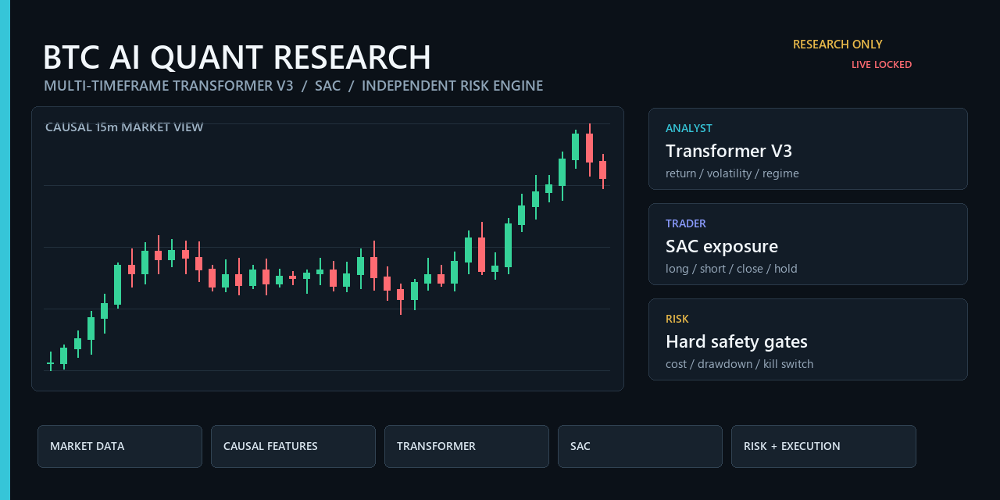

# BTC 多時間週期 AI 量化交易研究系統

[](https://github.com/ken951235789/ai-quant-trading-system/actions/workflows/quality.yml)


[English overview](README.en.md) · [五分鐘 Demo](docs/PUBLIC_DEMO.md) · [研究結果](docs/RESEARCH_RESULTS.md) · [系統架構](docs/ARCHITECTURE.md)



這是一套以 **BTC/USDT USD-M 永續合約**為研究標的的 Python 量化交易平台。系統使用已收盤的多時間週期 K 線建立因果特徵，由 Transformer V3 分析市場狀態，再由 SAC 輸出連續目標曝險，最後經過獨立風控、成本模型與執行層處理。

> 本專案是研究與工程作品，不構成投資建議，也不保證獲利。目前模型尚未通過正式資金品質閘門，Live Trading 預設鎖定。

**English summary:** A research-first BTC perpetual futures platform that connects causal multi-timeframe features, Transformer V3 forecasts, SAC target exposure, independent risk controls, cost-aware backtesting, paper trading and a locked live gateway. Current candidates have **not** passed the real-capital quality gate.

## 五分鐘離線 Demo

不需要 Binance 帳號、API Key、GPU、市場資料或模型權重。Demo 會使用固定 seed 的合成 BTC
15 分鐘行情，實際執行既有的因果特徵工程、模型輸出契約、SAC 目標曝險契約、獨立風控與
含成本執行層，最後產生 HTML 與 JSON 報告。

```powershell
git clone https://github.com/ken951235789/ai-quant-trading-system.git
cd ai-quant-trading-system
python -m venv .venv
.\.venv\Scripts\Activate.ps1
python -m pip install -e .
ai-quant-demo --open
```

Linux/macOS 將啟用指令改為 `source .venv/bin/activate`。報告位於
`outputs/public_demo/index.html`，稽核摘要位於 `outputs/public_demo/report.json`。

> Demo 的 Transformer／SAC 訊號是清楚標示的因果代理，不是訓練模型，也不代表策略績效。
> 正式研究結果與負面結果仍以封存的樣本外評估為準。

## 研究問題

本專案嘗試回答三個問題：

1. 多時間週期價格、趨勢、動能、波動、成交量與合約市場特徵，能否提供穩定的樣本外預測能力？
2. Transformer 的預測資訊能否協助 SAC 在扣除手續費、滑價與資金費率後建立正期望策略？
3. 如何用資料契約、Walk-forward、final holdout、風控與營運閘門，降低資料洩漏及回測過度配適？

## 系統架構

```text
Binance Futures REST / WebSocket
              |
              v
已收盤多時間週期 K 線 + Funding / OI / Spread / Order Book
              |
              v
因果對齊、資料品質檢查與特徵工程
              |
              v
Transformer V3：報酬、方向、波動、市場狀態與不確定性
              |
              v
SAC：做多、做空、減倉、平倉與連續目標曝險
              |
              v
獨立風控：部位、槓桿、停損、停利、日損與 Kill Switch
              |
              v
Walk-forward 回測 -> 模擬倉 -> Testnet -> Live 品質閘門
```

更完整的模組關係請閱讀 [系統架構](docs/ARCHITECTURE.md)。

## 核心設計

- 決策週期為 15 分鐘，研究資料可包含 `1m / 3m / 5m / 15m / 30m / 1h / 4h / 12h / 1d`。
- 高週期資料只在對應 K 線收盤後提供給模型，避免 Look-ahead Bias。
- Transformer 與 SAC 透過特徵、期限、Scaler、資料來源及模型中繼資料契約銜接。
- 原始 OHLCV 不直接作為 AI 輸入，改用報酬、ATR 比例、均線距離及標準化位置等資訊。
- SAC 使用連續動作表示目標持倉比例，不把「訓練 reward」當成樣本外收益。
- 新版 SAC 動作契約會區分空手等待、續抱與主動平倉，訓練與執行期共用同一映射。
- Transformer-only 基準會先扣除來回手續費、滑價與 Spread，並公平比較 5 根與 20 根預測。
- Transformer cross-fit 只把每折模型未見過的下一段 OOS 預測交給 SAC，資料尾端維持封存。
- 回測納入 Maker/Taker 手續費、滑價、Spread、Funding、強平與曝險限制。
- 模型須通過多 seed、Walk-forward、成本壓力測試及封存 final holdout，才可升級為 Champion。
- 減倉、平倉與緊急停機不會被模型品質閘門阻擋。

## 目前研究結果

目前 Transformer 在較長的 20 根預測上曾超越多數類別基準，但 5 根短線預測優勢仍不穩定。正式 SAC 候選在四次樣本外測試均為負，因此沒有升級為 Champion，也沒有開啟 final holdout。

這個結果保留在研究紀錄中，因為研究重點是建立可信的驗證流程，而不是只展示最好的一次回測。數字與限制請見 [研究結果](docs/RESEARCH_RESULTS.md)。

本輪 Transformer-only、SAC 消融與 cross-fit OOS 的設計及操作方式，請見
[Transformer 與 SAC 三項優化說明](docs/Transformer與SAC三項優化說明.md)。

## 專案結構

```text
src/ai_quant_trading/       系統原始碼
tests/                      單元與整合測試
scripts/                    資料、訓練、驗證與維運工具
configs/                    不含憑證的設定範例
migrations/                 PostgreSQL schema migration
monitoring/                 Prometheus、Grafana 與告警設定
docs/                       架構、研究與操作文件
data/*/README.md            資料目錄契約，不包含真實資料
```

公開版本不包含市場資料、模型權重、資料庫、交易紀錄、日誌、憑證或可執行檔。範圍與掃描方式請見 [公開版本安全說明](docs/PUBLIC_RELEASE_SCOPE.md)。

## 開發環境

- Python 3.11 以上
- Windows 或 Linux
- GPU 為 Transformer／SAC 正式訓練的選配需求，資料處理與測試可使用 CPU
- PostgreSQL、Prometheus 與 Grafana 可透過 Docker Compose 啟動

```powershell
git clone https://github.com/ken951235789/ai-quant-trading-system.git
cd ai-quant-trading-system
python -m venv .venv
.\.venv\Scripts\Activate.ps1
python -m pip install -e ".[dev,dashboard,ai,rl,database]"
Copy-Item .env.example .env
streamlit run src\ai_quant_trading\dashboard\app.py --server.address=127.0.0.1
```

請自行在 `.env` 填入 Testnet 憑證；不要提交 `.env`。正式交易預設停用。

## 驗證

```powershell
python -m ruff check src tests scripts
python -m pytest -q
ai-quant-demo --output outputs/public_demo_smoke --bars 360 --seed 11
```

## 研究倫理與限制

- 所有績效都應標示資料期間、成本、seed、資料切分與模型版本。
- 預測準確率不等同於交易獲利，訓練 reward 也不等同於樣本外報酬。
- 不以 final holdout 挑選模型或調整參數。
- 真實交易還需長期模擬倉、Testnet、對帳、斷線恢復與人工驗收。
- 專案中的歷史結果不能推論未來獲利。

## 授權

本公開儲存庫目前未授予再散布或商業使用授權，內容主要供可重現研究與技術交流。

## 參與專案

研究問題、Bug、可重現性改善與測試案例都歡迎透過 Issue 討論。送出 Pull Request 前請先閱讀
[貢獻指南](CONTRIBUTING.md)；安全問題請依 [安全政策](SECURITY.md) 私下回報。
