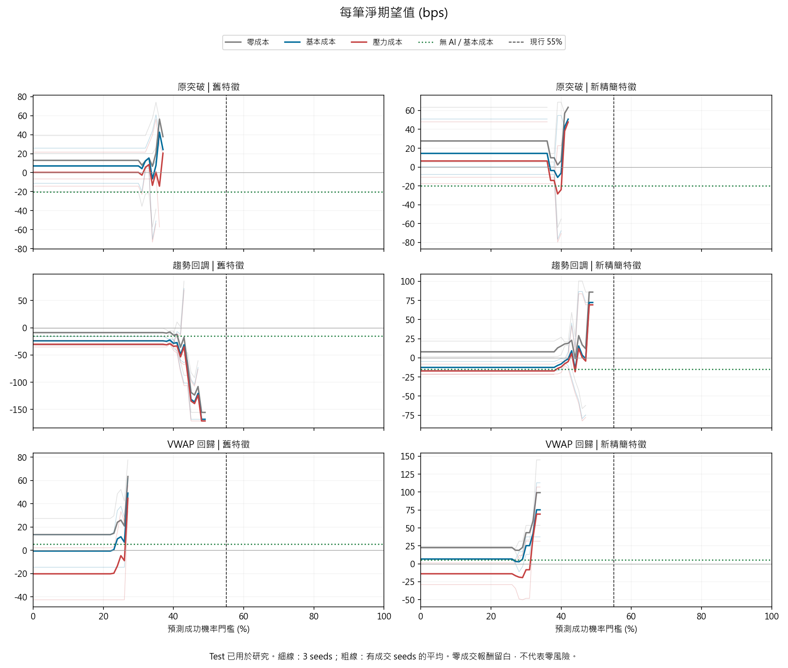
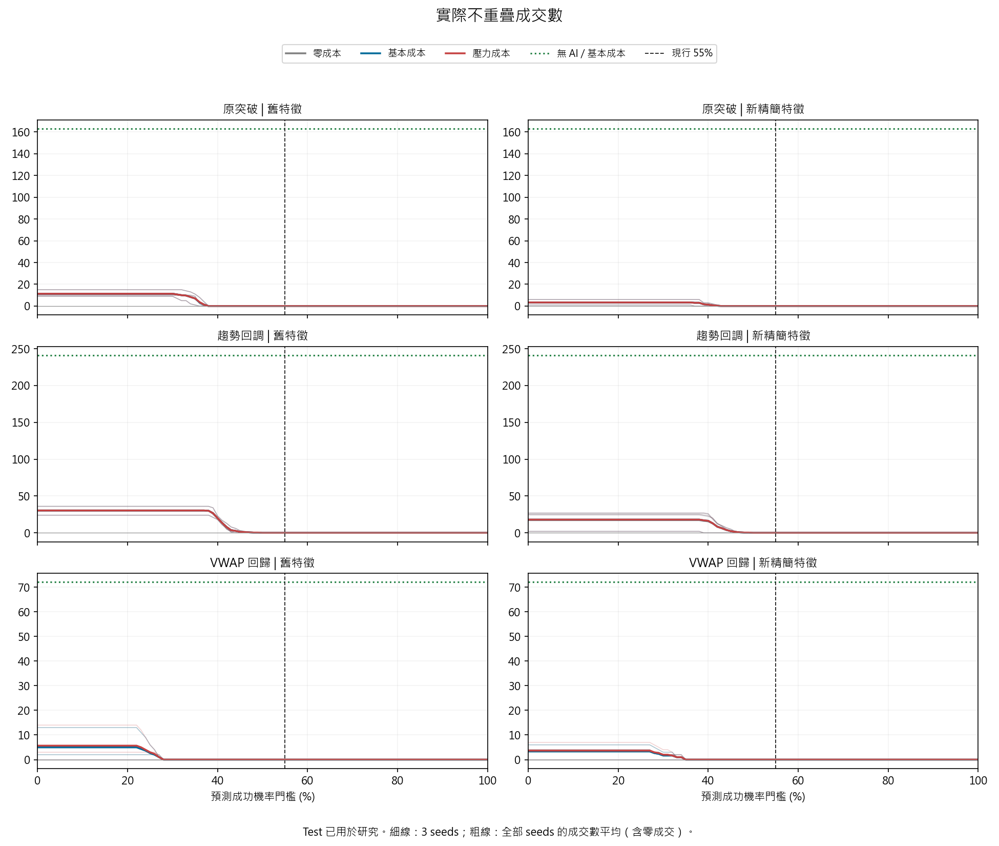
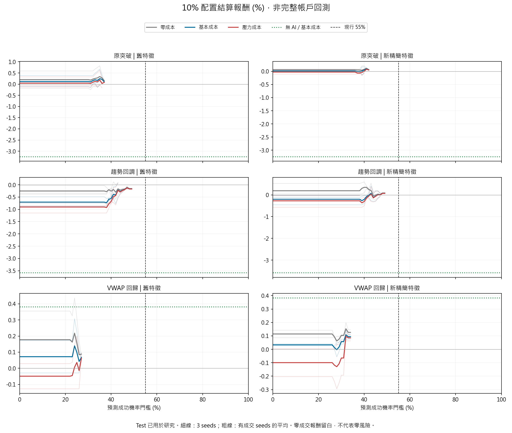

# 預測機率門檻：全範圍敏感度研究

## 範圍

18個既有Transformer，0%至100%每1%門檻，三種成本、Selection/Test分開，共10,908組比較。
三種策略、舊與新精簡特徵、seeds 42/137/2026，不額外訓練、不更換部署模型。
Test候選時間UTC 2025-09-17至2026-03-19；來源約五年，不是五年獨立樣本外回測。
全部歷史已被用於研究；101門檻、seeds及候選重疊都不能當作獨立證據擴增。

工程驗證通過；研究品質證據不足；SAC、Champion、實盤仍封鎖。

## 主要結果

|條件|結果|
|---|---|
|原55%機率門檻|18模型均零成交；Test校準成功機率最高約49.30%|
|降低門檻|能恢復部分成交，但沒有建立跨seed、跨期、成本壓力下穩定的優勢|
|0%門檻的新突破|seeds成交1/3/6筆，平均每筆+0.5082%/-0.0785%/+0.0042%|
|0%門檻的新趨勢回調|成交27/2/25筆，平均每筆-0.1692%/-0.1597%/-0.0474%|
|0%門檻的新VWAP|成交4/6/0筆，平均每筆+0.0641%/+0.0679%/無成交|

0%仍保留「模型預測淨收益 >2bps」，不等於無AI。新突破的393個Test候選，
每seed只有4/8/17個通過收益閘門，再經持倉與冷卻剩1/3/6筆。
這能解釋目前的少成交行為，但不是刪除收益閘門就能獲利的證據。

舊突破在32%～33%門檻下，三seeds的Test基本成本平均都正；
但32%僅5/10/15筆，壓力下其中一seed轉負，Selection另兩個seed為負。
這是事後敏感區，不是正式參數推薦。

## 低勝率是否能有正收益

|無AI VWAP基準|成交|實際勝率|每筆平均淨收益|Profit Factor|
|---|---:|---:|---:|---:|
|基本成本|72|47.22%|+0.0533%|1.179|
|壓力成本|75|38.67%|-0.0348%|0.900|

基本成本平均贏單+0.7424%，平均輸單-0.5632%，所以低於50%勝率仍可有正歷史平均。
然而描述性區間跨零、壓力成本轉負，尚不能確認真實長期正期望。

## 圖表

收益曲線的高點往往只有1～幾筆。粗線為seed平均，細線為個別seed。
收益平均只計有成交模型；成交數平均含零成交模型。完整公開聚合表含 `active_seeds`。
結算權益不是完整帳戶績效，未包含持倉浮虧、保證金、清算與每日停機。

## 固定契約與限制

- 次棒開盤市價成交、同棒停損優先、停損2ATR、停利4ATR、最長32棒、冷卻4棒。
- 基本成本：費用5bps/邊、滑價2bps/邊、完整價差1bp；壓力滑價再加3bps/邊。
- Funding使用每結算點1bp正準備金，不是歷史實際費率；稅後未驗證。
- 各成本各自重新撮合，會改變停損停利與排程；不能把零成本和基本成本之差當固定路徑歸因。
- 每筆收益以名目本金為分母，不能直接相加當成帳戶總報酬。
- 少於8筆不提供區塊CI；8筆不保證充分，CI也未作多重搜尋校正。
- 220個本機研究/回測/Transformer測試通過；216組原55%與無AI逐筆核對通過。
- 原始資料、模型權重、逐筆預測/交易、本機路徑和帳戶設定均不公開。

## 下一步

保持候選與退出固定，補上僅機率/僅收益/雙閘門的多時段比較。
門檻只在先行Calibration/Selection決定，Test不挑最高；跨期及成本壓力失敗就停止SAC/部署升級。
不是以加大模型、槓桿或成交次數作為預設解法。

[完整聚合JSON](research/probability_thresholds_20261005.json) · [操作與重現條件](PROBABILITY_THRESHOLD_SWEEP.md)
